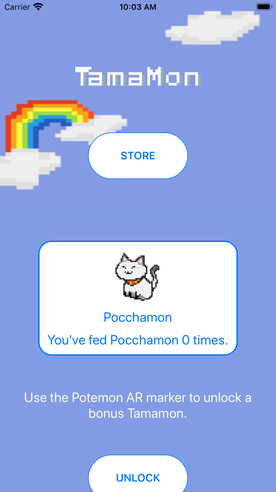
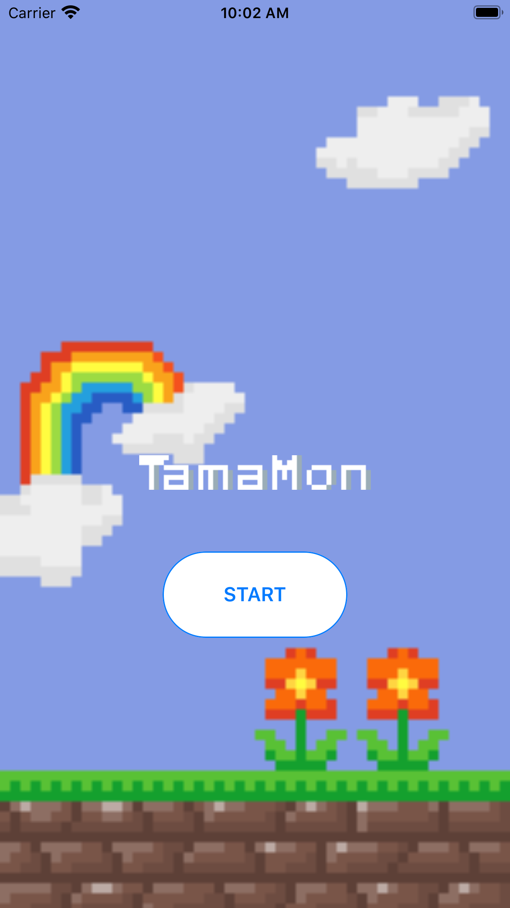
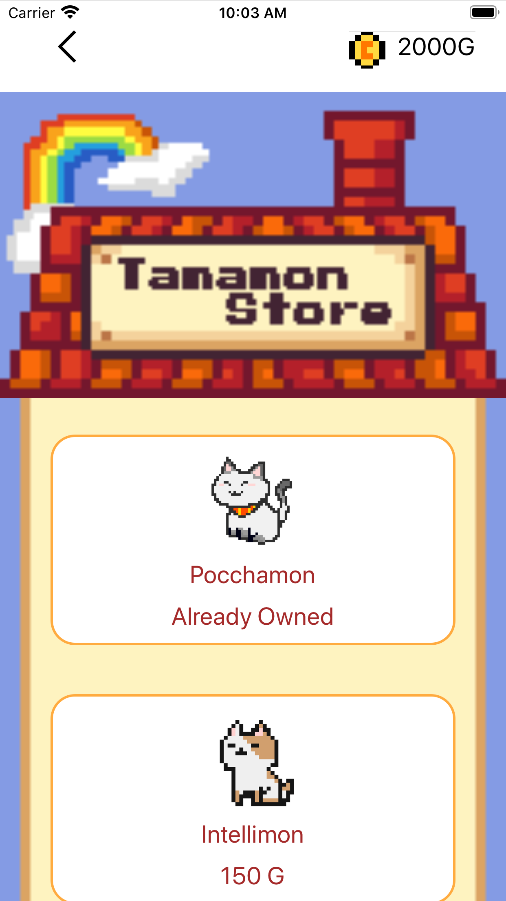

# Tamamon

This was created during our time as students at Code Chrysalis.


Tamamon is an interactive augmented reality game for collecting Tamamon that combines the best of Pokemon Go and Tamagotchi.

Tamamon allows you to interact with your Tamamon by feeding, playing and washing them. This will increase your in-game currency. If you leave a Tamamon for too long, your Tamamon's needs will increase, just like a real pet!

If you want to buy more Tamamon, head to the store and use your hard earned in-game currency to expand your collection.

## Link to APP store

# Created by:

Mary Sedarous

[Github](https://github.com/MarySed) || [LinkedIn](https://www.linkedin.com/in/marysedarous/)

Asami Kamiya

[Github](https://github.com/AsamiKamiya) || [LinkedIn](https://www.linkedin.com/in/asamikamiya68/)

Antonio Malacad

[Github](https://github.com/antoniomalacad) || [LinkedIn](https://www.linkedin.com/in/antonio-malacad/)

Daniel Reaney

[Github](https://github.com/djrcoder) || [LinkedIn](https://www.linkedin.com/in/djrcoder/)

<!--  -->






# For Developers

## Installation

1. Ensure that Homebrew, Node, and Watchman are installed in your device:

```
/usr/bin/ruby -e "$(curl -fsSL https://raw.githubusercontent.com/Homebrew/install/master/install)"
brew install node
brew install watchman
```

2. Ensure that the following CLIs are installed in your device:

```
npm install -g react-native-cli
npm install -g react-viro-cli
```

3. Ensure that Xcode and Ruby are installed in your device.

```
brew install ruby
```

4. Ensure that CocoaPods is installed in your device.

```
gem install cocoapods
pod repo update
```

If a write permission error occurs, install Ruby in a separate PATH.

```
echo 'export PATH="/usr/local/opt/ruby/bin:$PATH"' >> ~/.bash_profile
source ~/.bash_profile
```

Verify that the current Ruby is in a different path (not `/user/bin ruby`):

```
which ruby
```

Then retry installing CocoaPods.

5. In the root directory of the app, run yarn to install the packages and set up the iOS bundle:

```
yarn
./setup-ide.sh --ios
```

6. Modify the Podfile in /ios folder to have the correct ios version and pods.

- Change platform to ios 13.1
- Comment out or delete `use frameworks!`
- Replace `pod 'ViroKit', :path => '../node_modules/react-viro/ios/dist/ViroRenderer/'` with <br />
  `pod 'ViroKit_static_lib', :path => '../node_modules/react-viro/ios/dist/ViroRenderer/static_lib'`

7. Navigate to the iOS subdirectory, update the podfiles, and open the app in Xcode:

```
cd ios
pod update
pod install
open <app-name>.xcworkspace

```

8. To manually link "react-native-device-info"

Do NOT add pod 'RNDeviceInfo' in the podfile. Instead, we link it manually!

In XCode go to the project navigator:

    1. Right click Libraries

    2. Add Files to [project name]

    3. Go to node_modules/react-native-device-info/ios

    4. Add the file `RNDeviceInfo.xcodeproj`

    5. In XCode, in the project navigator, select your project

    6. Add the `libRNDeviceInfo.a` from the deviceinfo project to
       your project's Build Phases ➜ Link Binary With Libraries

    7. Click `.xcodeproj` file you added before in the project navigator and go the Build Settings tab.
       Make sure All is toggled on (instead of Basic)

    8. Look for Header Search Paths and make sure it contains both:

      $(SRCROOT)/../react-native/React

      and

      $(SRCROOT)/../../React

      Check that both have been marked as recursive

    9. Clean the Build folder (Shift + Cmd + K), click Build and run your project (Cmd+R)

## Resources

1. [Xcode with ViroReact](https://docs.viromedia.com/docs/starting-a-new-viro-project-1) <br/>
2. [ViroReact Quick Start](https://docs.viromedia.com/docs/quick-start) <br />
3. [Ruby Installation for Macs](https://stackify.com/install-ruby-on-your-mac-everything-you-need-to-get-going/) <br/>
4. [Manually Linking React Native Device Info](https://www.npmjs.com/package/react-native-device-info/v/0.9.1) <br/>


